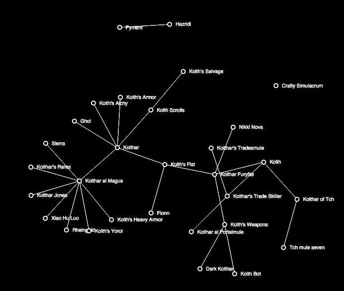

# TreeStats

TreeStats is an offline player tracking program for [Asheron's Call](http://www.asheronscall.com/) (AC). AC was one of the earliest popular [MMORPG](http://en.wikipedia.org/wiki/Massively_multiplayer_online_role-playing_game) titles and was released in 1999. One of the defining characteristics of AC was its Allegiance system, which allowed players to swear fealty to other players, affording the involved players concrete (e.g. experience and rank for patrons) and social benefits (e.g. items, advice for the vassal) which added greatly to the immersive nature of the game.

As vassals gained experience points for themselves, a portion of that experience was passed up to the patron. Players soon manipulated and gamed the system to form efficient experience passup chains and out of this came the original versions of TreeStats, written by [Akilla](http://www.akilla.net/).

A long time has passed since TreeStats lived and I've decided to bring it back as a side project. Much fewer players play the game these days so the purpose of this project is left to the reader.


## What TreeStats Does

TreeStats records ingame data from your characters using the [Decal](http://www.decaldev.com/) plugin, sends it to [the web app](http://TreeStats.net), which stores it in a web-accessible database for convenient out-of-game browsing. The web interface is designed to be reminiscent of the old TreeStats website and also to stay true to the design of Asheron's Call itself (because why not?). Three main types of data are collected by the Decal plugin:

- Player metadata, attributes, vitals, and skills, etc.
- Allegiance information (Monarchs, patrons, and vassals)
- Server population counts

A novel feature of the new TreeStats, compared to the original version, is that it uses [D3.js](http://d3js.org) to show allegiance trees and character chains (all vassals):


Here's a particular characters' chain (as it is known to TreeStats):


And the entire allegiance tree, drawn as a force-directed graph (again, as it is known to TreeStats):




One limitation of TreeStats is that it only knows about monarchs, patrons, and vassals of the characters that are directly uploaded (i.e. what is on your Allegiance pane). It won't know about the characters in between unless those players upload their characters using the plugin directly.

## Structure

TreeStats comes in two parts:

- A [Decal](http://www.decaldev.com/) plugin
- A web app that the Decal plugin communicates with (http://treestats.net)

## Development

### Updating Private Servers

The list of private servers TreeStats uses is 1:1 with the [community servers list](https://github.com/acresources/serverslist).
TreeStats is manually synchronized with the list by running,

```sh
be rake servers:sync
```

This updates `./data/servers.rb` which stores the data.

## Contribute

I am of course open to any feature requests or bug reports. Please use the Issues feature to send those in. The other thing I could use help with is discovering what the unknown character properties are. You'll notice that each player's page has a tab for Unknown Properties. I store a lot more data than is display in a structured way, and this is because I don't know what everything is. On the Unknown Properties tab are pairs of IDs and Values. If you do Decal development, you might know these as Character Property DWORD values. If the value of something sticks out as being a particular thing, please let me know.

## Run your own TreeStats

I made this open source primarily so people can know what the plugin and web app are doing but secondarily so people can give me advice on my code or run their own TreeStats clone on their own setup.

Both the Decal plugin and the web app are incomplete source code as each of them implement encryption methods to help prevent people from sending bogus information over the wire from the plugin to the web app. The source code for these features is not committed to version control in order to keep the method secret. If you try to compile the plugin or run the web app you'll need to reimplement these features or remove them from the source code.
